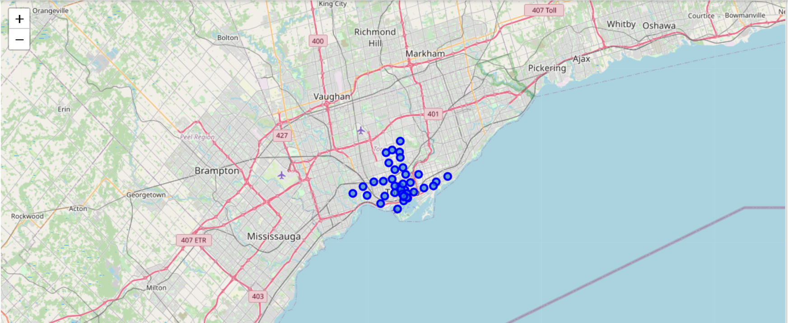
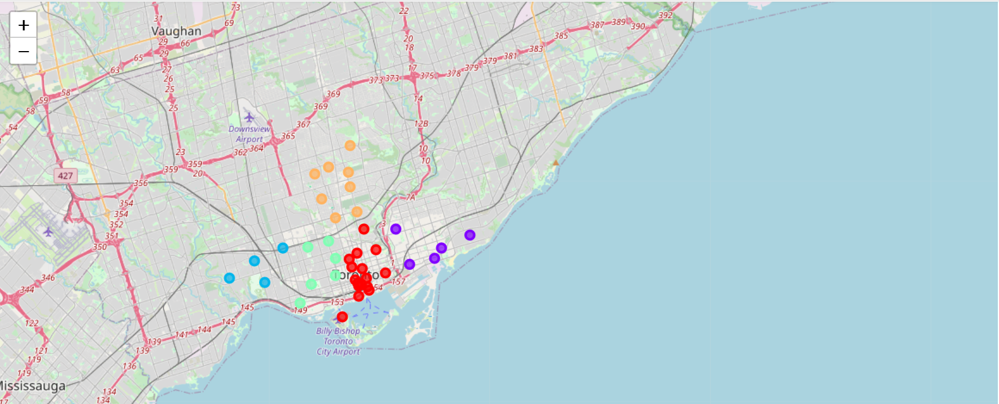

# Coursera_Capstone

## Assignment 1
Click on Capstone_project.ipynb file

## Parts 1, 2 and 3 of the project
Click on Capstone_Project_Full.ipnyb file. This file will be updated as each part of the project is completed. Since GitHub cannot display the map rendered in Jupyter lab, I have included it here: 

The KMeans cluster map for Toronto is shown below: 

